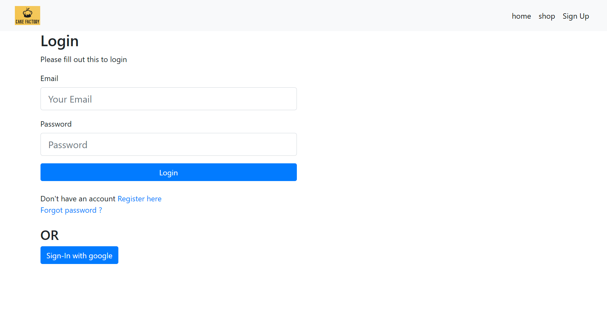
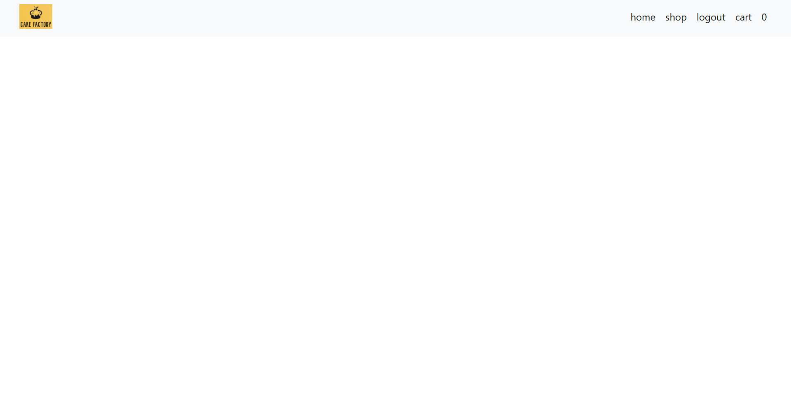
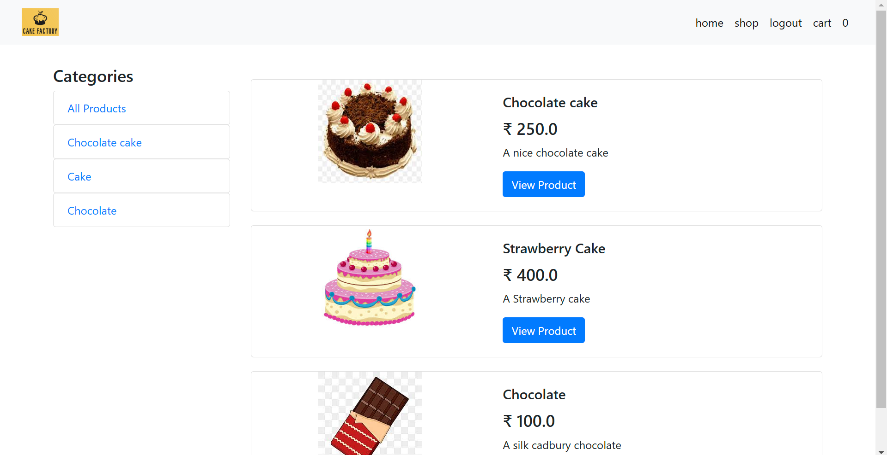
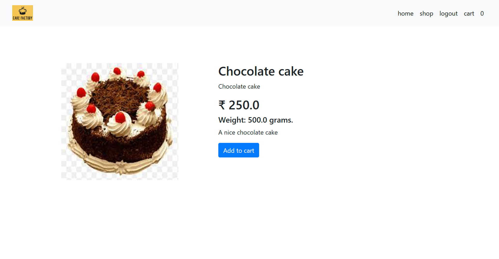
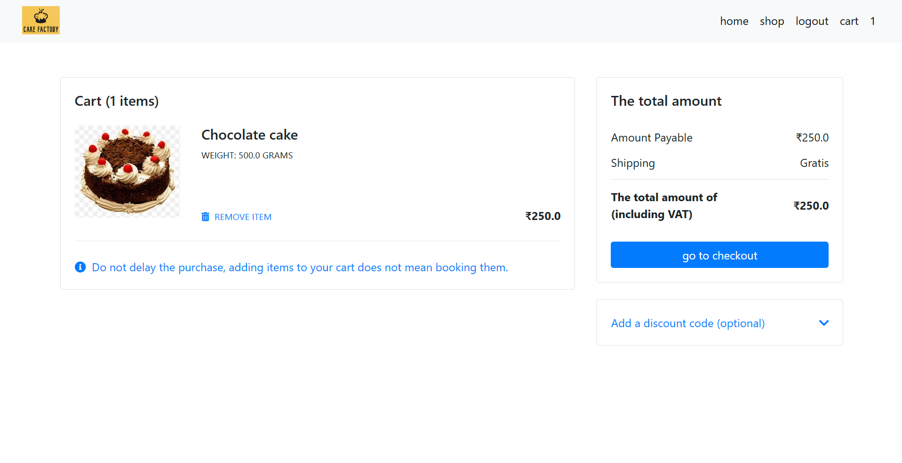
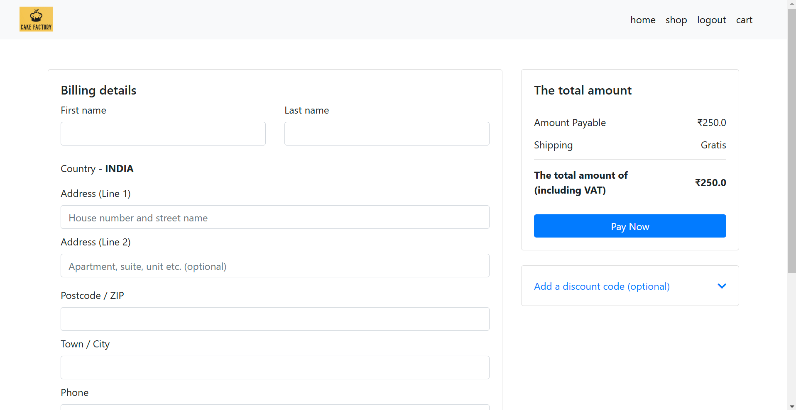

# E-commerce Website

## Description
An E-commerce Website built with **Spring Boot** and **H2 Database**, featuring **Thymeleaf** for the front end. This project allows users to browse and purchase products, with login support via email and password, as well as Google sign-in integration.

---

## Features
- Email and Password Login
- Google Sign-In Support
- Product Filtering and Sorting
- Shopping Cart Integration

### Screenshots

#### Login Page

The above image displays the login page of the E-commerce website. Users can log in using their email ID and password. Additionally, Google sign-in is also supported for a quicker login experience.

#### Home Screen

This is the main home screen of the website, where users can browse through the front end, showcasing the website's features and products.

#### Shop Page

This page displays all available products. Users can filter products by type from the options on the left-hand side of the screen.

#### Product Details

By selecting a product on the shop page and clicking the "View Product" button, users can view product details and add the item to their cart.

#### Cart Page

The cart page displays products added to the user's cart, allowing them to review their selections before proceeding to checkout.

#### Checkout

In the checkout page you can add the delivery details. And use the pay now feature to go to payment page. As of now, payment page has not been integrated into it.

---

## Technologies Used
- **Spring Boot**
- **H2 Database**
- **Thymeleaf**

---

